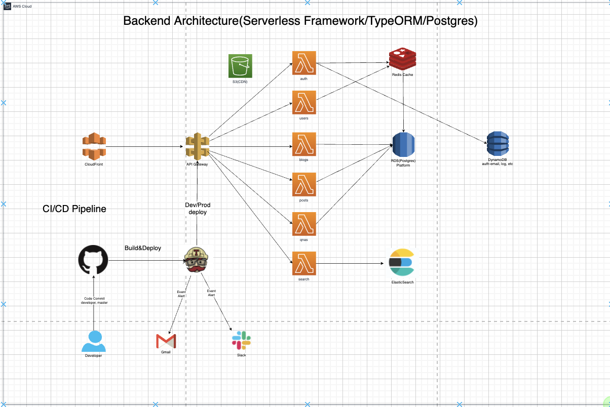

# browny_backend

## Overview

### Architecture


## Preparation
```
install node 12

git clone https://github.com/Browny9532/browny_backend.git

yarn global add serverless

serverless config credentials --provider aws --key [aws access key] --secret [aws secret key]

yarn install

```

### Development
#### deployment
- development : yarn deploy && npx sls deploy --stage dev
- production : yarn deploy:prod && npx sls deploy --stage prod


### Test Local
#### sls offline
- npx sls package
- sls offline
- postman + insomnia + api tool test


#### invoke local
- sls invoke local -f {serverless.yml function name} -p payload/{payload file}
- sls invoke local -f getuser -p payload/find.json
- sls invoke local -f createuser -p payload/create.json
- ...etc

## Reference
```
https://www.serverless.com/framework/docs
https://www.npmjs.com/package/serverless-typeorm
https://github.com/velopert/velog-server
```
